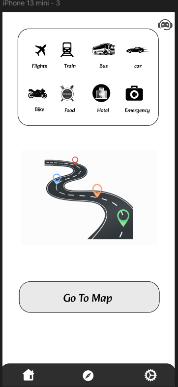
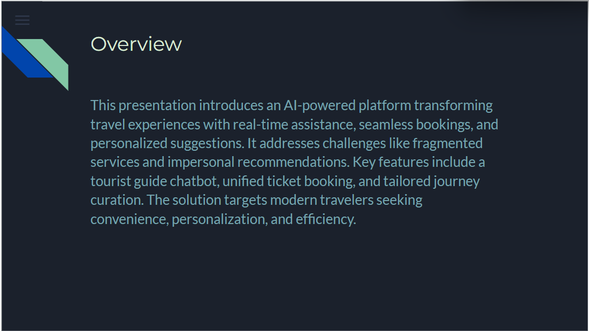
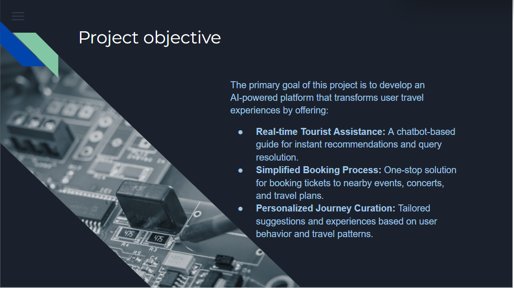
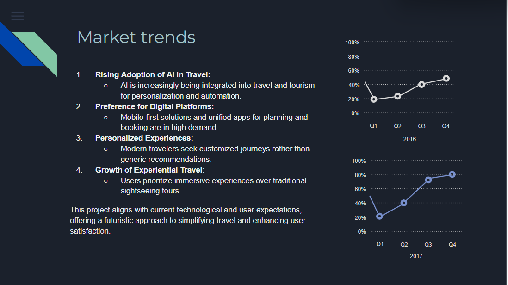

# Urban-Wander

## Drive link
[Click Here](https://drive.google.com/file/d/1cteC1JGbz0wD3_bjjaCF6KDEk7Kw8xKZ/view?usp=sharing)

## Prototype Link
[Click here](https://www.figma.com/proto/PgElStuj12bRJWbsNVxfS1/Untitled?node-id=1-3&p=f&t=PS8qy0FfGDnWGRCs-1&scaling=scale-down&content-scaling=fixed&page-id=0%3A1&starting-point-node-id=1%3A2)

## Figma Link
[Click here](https://www.figma.com/design/PgElStuj12bRJWbsNVxfS1/Untitled?node-id=0-1&p=f&t=TUvgvlvoP1gHau46-0)

## Login Page

## Home Page

## Accessibility Features

## Map

## Settings

## ChatBot

## Slide Desk
[Click here](https://docs.google.com/presentation/d/1mcYsL3_UoABX2fj_lAKZwPd1zbFo6lKALmJN4xlXseA/edit?usp=sharing)

## Urban wander

## Overview

## Understanding the Problem

## Objective

## Target Audience

## Market

## SpotLights

