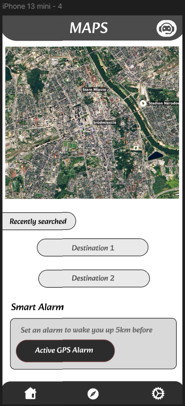
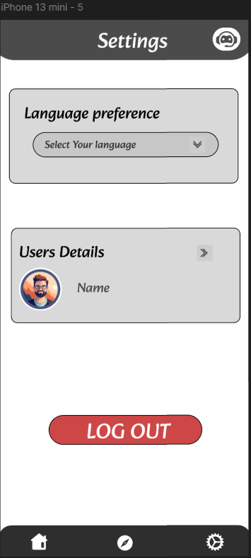
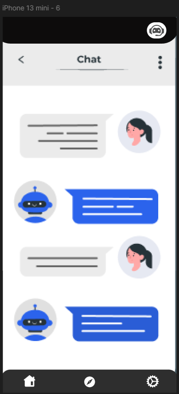

# Urban-Wander

## Drive link
[Click Here](https://drive.google.com/file/d/1cteC1JGbz0wD3_bjjaCF6KDEk7Kw8xKZ/view?usp=sharing)

## Prototype Link
[Click here](https://www.figma.com/proto/PgElStuj12bRJWbsNVxfS1/Untitled?node-id=1-3&p=f&t=PS8qy0FfGDnWGRCs-1&scaling=scale-down&content-scaling=fixed&page-id=0%3A1&starting-point-node-id=1%3A2)

## Figma Link
[Click here](https://www.figma.com/design/PgElStuj12bRJWbsNVxfS1/Untitled?node-id=0-1&p=f&t=TUvgvlvoP1gHau46-0)

   

      
      
Login Page

   

   

      
      
Home Page

   

   

      
      
Accessibility Features

   

   

      
      
Map

   

   

      
      
Settings

   

   

      
      
ChatBot

   

## Slide Desk
[Click here](https://docs.google.com/presentation/d/1mcYsL3_UoABX2fj_lAKZwPd1zbFo6lKALmJN4xlXseA/edit?usp=sharing)

# Introduction

Welcome to our presentation on AI-Powered Travel Experiences. This presentation introduces an AI-powered platform that transforms travel experiences with real-time assistance, seamless bookings, and personalized suggestions.

# Problem Statement

Travelers face challenges like fragmented services, impersonal recommendations, and a lack of real-time assistance. These issues can lead to a less enjoyable and efficient travel experience.

# Key Features

- **Tourist Guide Chatbot**: Provides real-time assistance and information.
- **Unified Ticket Booking**: Simplifies the booking process for flights, hotels, and attractions.
- **Personalized Journey Curation**: Tailors travel plans based on user preferences and behavior.

# Target Audience

Our solution targets modern travelers who seek convenience, personalization, and efficiency in their travel experiences. This includes frequent travelers, business travelers, and vacationers.

# Benefits

- **Enhanced Convenience**: Streamlined booking process and real-time assistance.
- **Personalized Recommendations**: Tailored suggestions based on user preferences.
- **Improved Efficiency**: Faster and more enjoyable travel experience.

# Conclusion

Our AI-powered platform revolutionizes the way people travel by offering a seamless, personalized, and efficient experience. We address the common challenges faced by travelers and provide a comprehensive solution that enhances their journey.
