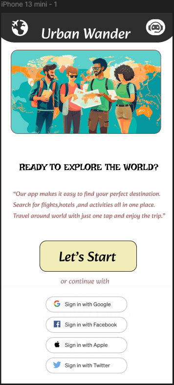
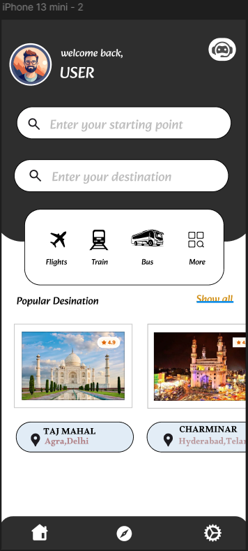

# Urban-Wander

## Prototype Link for Urban Wander app
[link text](https://www.figma.com/proto/PgElStuj12bRJWbsNVxfS1/Untitled?node-id=1-3&p=f&t=PS8qy0FfGDnWGRCs-1&scaling=scale-down&content-scaling=fixed&page-id=0%3A1&starting-point-node-id=1%3A2)

## Figma Link
[link text]((https://www.figma.com/design/PgElStuj12bRJWbsNVxfS1/Untitled?node-id=0-1&p=f&t=TUvgvlvoP1gHau46-0))

## Home Page

## Interface

## All Things

## Map

## Settings

## ChatBot

